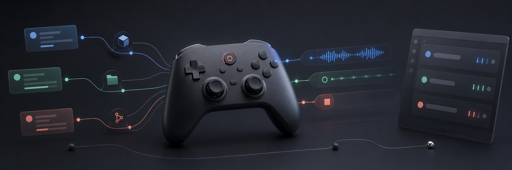
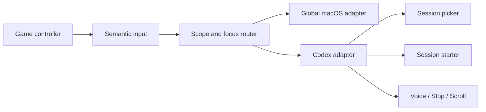

<div align="center">
  

  <br>

  <h1>Agent Controller</h1>

  [](https://www.swift.org/)
  [](https://www.apple.com/macos/)
  [](LICENSE)
  

  **Switch tasks, start sessions, dictate, submit, stop, and scroll—without leaving the controller.**
</div>

Agent Controller is a native macOS control layer for existing AI tools. It
turns physical controller input into semantic actions, then lets a scoped app
adapter deliver each action. Codex is the first supported cockpit.

It does not replace Codex, scrape its sidebar, or mirror its interface.

## Controller map

| Input | Default action | Scope |
|---|---|---|
| `LB` | Hold to preview recent tasks; release to open one | Codex |
| `L3` | Hold to preview project roots; release to start a task there | Codex |
| `RB` | Hold to talk; release to finish dictation | Codex |
| `X` | Stop the managed or frontmost task | Codex |
| Right stick | Proportional vertical scrolling | Codex |
| `LT` | Hold Command | Global |
| `RT` | Tab pulse; use with `LT` to switch apps | Global |
| `A` | Enter; use with `LT` for Command+Enter | Global |
| `B` | Cancel the active selector or retry a safe release | Global |
| `Y` | Open Agent Controller | Global |

Keyboard-backed outputs are configurable from the control center. Push to Talk
defaults to `Control+Shift+D`.

## Why semantic actions?

A controller button should mean **open session picker**, not `⌘⇧B`. The app
owns controller semantics and context; adapters translate those actions into
the safest native contract available for the frontmost app.



## What works today

### Exact session selection

Hold `LB` to freeze up to ten recent interactive Codex tasks. Choose with the
D-pad or left stick, preview without changing Codex, then release to revalidate
and open that exact task.

### Project-based Session Starter

Hold `L3` to freeze recent project roots discovered from real Codex sessions.
Release on a project to start one persistent task with that exact working
directory. Cancel, focus drift, disconnect, or an invalid directory creates
nothing.

### Push to Talk, Stop, and scrolling

`RB` delegates audio capture and transcription to Codex, leaving the result
editable and unsent. `X` stops the exact task last opened through `LB` or
created through `L3`; a bounded current-task fallback is available when no
managed target exists. The right stick sends proportional scroll events only
after revalidating the same frontmost Codex window.

## Safety model

Agent Controller is deliberately small and local:

- Starts paused on every launch.
- Requires an exact frontmost Codex process for Codex-local actions.
- Freezes targets at gesture start and revalidates before delivery.
- Uses no network access in the MVP.
- Does not record prompts, task names, paths, keystrokes, clipboard data,
  accessibility trees, or user content.
- Provides no approve, reject, shell, destructive, or unattended-send action.

## Build locally

Requirements:

- macOS 14 or newer
- Swift 6.1 toolchain
- Codex desktop and the Codex CLI
- An Xbox-, PlayStation-, or compatible controller recognized by
  `GameController`

```bash
scripts/build-app.sh
open ".build/Agent Controller.app"
```

Pair the controller in macOS System Settings, open Codex, and arm Agent
Controller from its menu bar or control center. macOS Accessibility permission
is required for global keyboard delivery, Push to Talk, and scrolling.

> This is a source-first MVP. It is not currently distributed as a notarized
> download; build and run it locally.

## Architecture

The Swift package keeps intent separate from delivery:

```text
AgentControllerCore    pure value types, interpreters, gates, state machines
AgentControllerMac     bounded macOS and Codex adapters
AgentControllerApp     controller input, routing, lifecycle, SwiftUI/AppKit UI
```

Every Swift source and test file is limited to 500 lines, enforced by the
repository checks and app build.

## Verify a change

```bash
scripts/check-source-size.sh
swift test --disable-sandbox
swift build --disable-sandbox
scripts/build-app.sh
```

The deterministic suite currently contains 96 tests. Opt-in live contracts
exercise local Codex session inventory and Stop IPC without printing task
titles, paths, prompts, or stopping a real task:

```bash
AGENT_CONTROLLER_LIVE_CODEX_SESSIONS=1 swift test --filter CodexAppServerClientLiveTests
AGENT_CONTROLLER_LIVE_CODEX_STOP_IPC=1 swift test --filter CodexDesktopStopLiveTests
```

Physical controller, microphone, focus-loss, and alternate-window behavior
still require manual acceptance on the built app.

## Roadmap

- Additional app adapters without changing the semantic input layer.
- A stable managed-session registry across supported agent tools.
- Optional local speech adapters behind the existing Push to Talk contract.
- Distribution signing, notarization, and an updater after the interaction
  model has broader physical proof.

## Contributing

Issues and focused pull requests are welcome. Read [CONTRIBUTING.md](CONTRIBUTING.md)
before changing controller semantics, app contracts, or privacy boundaries.

## License

Agent Controller is available under the [Apache License 2.0](LICENSE).
