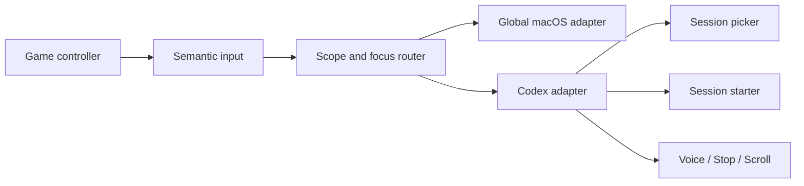

<div align="center">
  

  <br>

  <h1>Agent Controller</h1>

  [English](README.md) | 简体中文

  [](https://www.swift.org/)
  [](https://www.apple.com/macos/)
  [](LICENSE)
  

  **用手柄切换任务、创建会话、语音输入、提交、Stop 和滚动。**
</div>

Agent Controller 是一个原生 macOS 控制层，把实体手柄的输入变成明确的
语义动作，再交给当前应用的 adapter 执行。现在首先支持 Codex；Codex
仍然是你的工作主界面，Agent Controller 负责调度与切换。

它不会接管 Codex，也不会解析侧栏或复制 Codex 的界面。

## 手柄怎么用

| 输入 | 默认动作 | 生效范围 |
|---|---|---|
| `LB` | 按住查看最近任务，松开后打开所选任务 | Codex |
| `L3` | 按住选择项目目录，松开后在该项目中创建任务 | Codex |
| `RB` | 按住说话，松开结束语音输入 | Codex |
| `X` | Stop 当前受管任务或前台任务 | Codex |
| 右摇杆 | 按推动幅度纵向滚动 | Codex |
| `LT` | 按住 Command | 全局 |
| `RT` | 触发一次 Tab；配合 `LT` 切换应用 | 全局 |
| `A` | Enter；配合 `LT` 触发 Command+Enter | 全局 |
| `B` | 取消当前选择，或重试未完成的按键释放 | 全局 |
| `Y` | 打开 Agent Controller | 全局 |

依赖键盘事件的输出可以在控制中心重新配置。Push to Talk 默认使用
`Control+Shift+D`。

## 核心思路：按键表示意图

`LB` 表示的是 **打开 Session Picker**，不是某一组写死的快捷键。Agent
Controller 统一管理手柄语义与当前上下文；每个 app adapter 再把语义动作
转换成该应用可用、并且尽量安全的原生操作。



## 现在能做什么

### 精确选择任务

按住 `LB` 时，Agent Controller 会固定当下的最近任务列表，最多十条。你可以
用方向键或左摇杆预览，期间 Codex 不会切换；松开 `LB` 后，它会再次校验并
只打开你选中的那条任务。

### 从项目目录创建任务

按住 `L3` 会显示从真实 Codex 历史中整理出的近期项目目录。选中项目并松开
后，Agent Controller 会以所选目录作为准确的 working directory，创建一个持久化
任务。按 `B` 取消、焦点变化、手柄断开、目录失效，都会直接放弃，不创建任务。

### Push to Talk、Stop 与滚动

按住 `RB` 时，录音和转写仍由 Codex 完成；松开后文字留在 Codex 中供你确认，
不会自动发送。`X` 会优先停止最近一次通过 `LB` 打开或通过 `L3` 创建的目标
任务；没有受管目标时，才使用范围受限的当前任务回退方案。右摇杆每次发送
滚动事件前，都会重新确认前台仍是同一个 Codex 窗口。

## 安全边界

这个 MVP 的边界有意保持克制：

- 每次启动都默认暂停，必须由用户手动启用。
- Codex 专属动作只在前台进程准确匹配 Codex 时生效。
- 手势开始时锁定目标，真正执行前再次校验。
- MVP 不访问网络。
- 不记录 prompt、任务名、项目路径、按键、剪贴板、Accessibility tree 或用户内容。
- 不提供 approve、reject、shell、破坏性操作或无人值守发送。

## 在本机跑起来

你需要：

- macOS 14 或更新版本
- Swift 6.1 toolchain
- Codex desktop 与 Codex CLI
- Xbox、PlayStation，或其他能被 `GameController` 识别的手柄

```bash
scripts/build-app.sh
open ".build/Agent Controller.app"
```

先在 macOS 系统设置中配对手柄，再打开 Codex，并从菜单栏或控制中心启用
Agent Controller。全局键盘事件、Push to Talk 和滚动需要 macOS
Accessibility 权限。

> 当前阶段只提供源码，不提供经过 notarization 的安装包。请在本机自行构建运行。

## 代码结构

Swift package 把“想做什么”和“如何执行”分开：

```text
AgentControllerCore    pure value types, interpreters, gates, state machines
AgentControllerMac     bounded macOS and Codex adapters
AgentControllerApp     controller input, routing, lifecycle, SwiftUI/AppKit UI
```

所有 Swift 源文件与测试文件都不能超过 500 行；仓库检查和 app 构建会共同
执行这一限制。

## 开发与验证

```bash
scripts/check-source-size.sh
swift test --disable-sandbox
swift build --disable-sandbox
scripts/build-app.sh
```

当前有 96 个确定性测试。下面两组可选 live tests 会验证本机 Codex 的任务
清单和 Stop IPC；它们不会打印任务标题、项目路径或 prompt，也不会停止真实任务：

```bash
AGENT_CONTROLLER_LIVE_CODEX_SESSIONS=1 swift test --filter CodexAppServerClientLiveTests
AGENT_CONTROLLER_LIVE_CODEX_STOP_IPC=1 swift test --filter CodexDesktopStopLiveTests
```

实体手柄、麦克风、焦点变化和不同窗口布局，仍然需要在构建后的 app 中手动验收。

## 接下来

- 在不改动语义输入层的前提下，支持更多 app adapter。
- 为不同 agent 工具建立统一、稳定的 managed-session registry。
- 在现有 Push to Talk 契约下，接入可选的本地语音 adapter。
- 等交互模型积累更多实体设备验证后，再做分发签名、notarization 和 updater。

## 参与贡献

欢迎提交 Issue 和范围清晰的 Pull Request。改动手柄语义、应用契约（app contract）或隐私
边界之前，请先阅读 [CONTRIBUTING.md](CONTRIBUTING.md)。

## License

Agent Controller 使用 [Apache License 2.0](LICENSE)。
